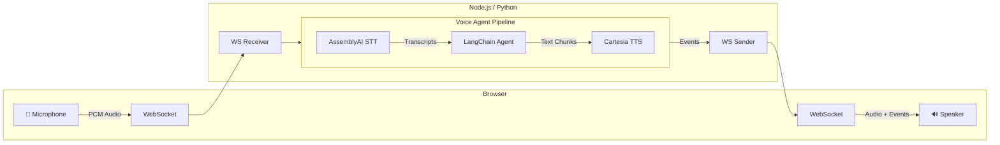

# Voice Sandwich Demo 🥪

A real-time, voice-to-voice AI pipeline demo featuring a sandwich shop order assistant. Built with LangChain/LangGraph agents, AssemblyAI for speech-to-text, and Cartesia for text-to-speech.

## Architecture

The pipeline processes audio through three transform stages using async generators with a producer-consumer pattern:



### Pipeline Stages

Each stage is an async generator that transforms a stream of events:

1. **STT Stage** (`sttStream`): Streams audio to AssemblyAI, yields transcription events (`stt_chunk`, `stt_output`)
2. **Agent Stage** (`agentStream`): Passes upstream events through, invokes LangChain agent on final transcripts, yields agent responses (`agent_chunk`, `tool_call`, `tool_result`, `agent_end`)
3. **TTS Stage** (`ttsStream`): Passes upstream events through, sends agent text to Cartesia, yields audio events (`tts_chunk`)

## Prerequisites

- **Node.js** (v18+) or **Python** (3.11+)
- **pnpm** or **uv** (Python package manager)

### API Keys

| Service | Environment Variable | Purpose |
|---------|---------------------|---------|
| AssemblyAI | `ASSEMBLYAI_API_KEY` | Speech-to-Text |
| Cartesia | `CARTESIA_API_KEY` | Text-to-Speech |
| Anthropic | `ANTHROPIC_API_KEY` | LangChain Agent (Claude) |

## Quick Start

### Using Make (Recommended)

```bash
# Install all dependencies
make bootstrap

# Run TypeScript implementation (with hot reload)
make dev-ts

# Or run Python implementation (with hot reload)
make dev-py
```

The app will be available at `http://localhost:8000`

### Kitchen Display

This project includes a real-time kitchen screen at:

```bash
http://localhost:8000/kitchen
```

Open the main experience at `http://localhost:8000` and the kitchen screen at
`http://localhost:8000/kitchen` in another window. When the voice agent confirms
an order with the `confirm_order` tool, the TypeScript backend stores the order
in memory and broadcasts an `order_created` event to all connected kitchen
clients through `/kitchen-ws`. The kitchen screen receives the event immediately,
without refreshing the page.

Kitchen staff can move each order through these states:

- `nuevo`
- `en preparacion`
- `listo`

The backend also advances demo orders automatically from `nuevo` to
`en preparacion` and then to `listo`, broadcasting each `order_updated` event so
every open kitchen screen changes in real time. Kitchen staff can still use the
status button to update an order manually through the same WebSocket flow.

To test the real-time flow, keep `/kitchen` open while confirming an order from
the main voice experience. The order should appear in the kitchen screen without
refreshing the page.

### Manual Setup

#### TypeScript

```bash
cd components/typescript
pnpm install
cd ../web
pnpm install && pnpm build
cd ../typescript
pnpm run server
```

#### Python

```bash
cd components/python
uv sync --dev
cd ../web
pnpm install && pnpm build
cd ../python
uv run src/main.py
```

## Project Structure

```
components/
├── web/                 # Svelte frontend (shared by both backends)
│   └── src/
├── typescript/          # Node.js backend
│   └── src/
│       ├── index.ts     # Main server & pipeline
│       ├── assemblyai/  # AssemblyAI STT client
│       ├── cartesia/    # Cartesia TTS client
│       └── elevenlabs/  # Alternate TTS client
└── python/              # Python backend
    └── src/
        ├── main.py             # Main server & pipeline
        ├── assemblyai_stt.py
        ├── cartesia_tts.py
        ├── elevenlabs_tts.py   # Alternate TTS client
        └── events.py           # Event type definitions
```

## Event Types

The pipeline communicates via a unified event stream:

| Event | Direction | Description |
|-------|-----------|-------------|
| `stt_chunk` | STT → Client | Partial transcription (real-time feedback) |
| `stt_output` | STT → Agent | Final transcription |
| `agent_chunk` | Agent → TTS | Text chunk from agent response |
| `tool_call` | Agent → Client | Tool invocation |
| `tool_result` | Agent → Client | Tool execution result |
| `agent_end` | Agent → TTS | Signals end of agent turn |
| `tts_chunk` | TTS → Client | Audio chunk for playback |

## Kitchen Architecture

The kitchen extension keeps the original event-driven architecture:

1. The customer confirms a sandwich order in the main voice experience.
2. The LangChain tool `confirm_order` calls the backend order registry.
3. The backend creates an order with an ID, items, timestamp, and `new` status.
4. The backend emits `order_created` over `/kitchen-ws`.
5. The Svelte `/kitchen` route updates its order columns automatically.
6. Automatic timers and status buttons emit status changes; the backend responds
   with `order_updated` for all connected kitchen clients.

Technologies used for this extension:

- Hono WebSocket routes on the TypeScript backend
- Svelte stores for live kitchen state
- Tailwind CSS for the kitchen display layout
- In-memory order storage for the demo
